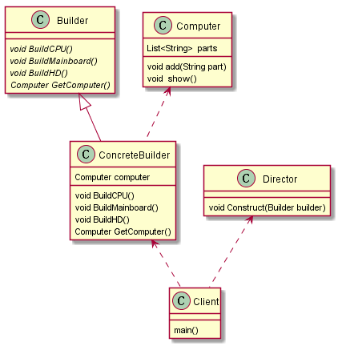

## 建造者模式
### 1 简介
### 1.1定义
将一个复杂对象的创建与它的表示分离，使得同样的构建过程可以创建不同的表示
### 1.2主要作用
在用户不知道对象的建造过程和细节的情况下就可以直接创建复杂的对象。
* 用户只需要给出指定复杂对象的类型和内容;
* 建造者模式负责按顺序创建复杂对象(把内部的建造过程和细节隐藏起来)

## 2.模式原理
**UML类图**

电脑城老板（Diretor）和客户（Client）进行需求沟通（买来打游戏？学习？看片？）
了解需求后，电脑城老板将小成需要的主机划分为各个部件（Builder）的建造请求（CPU、主板）
指挥装机人员（ConcreteBuilder）去构建组件；
将组件组装起来成小成需要的电脑（Product）

### 2.1优点
* 解耦
将产品本身与产品创建过程解耦，可以使用相同的创建过程得到不同的产品。
* 易于精确控制对象的创建
将复杂产品的创建步骤分解在不同的方法中，是的创建过程更加清晰
* 易于拓展
增加新的具体建造者无需修改原有代码。开闭原则

### 2.2缺点
1. 建造者模式所创建的产品一般具有较多共同点，其组成部分相似;如果产品之间的差异性很大，则不适合该模式
2. 如果产品内部发生复杂变化，可能会导致需要定义很多具体建造者类来实现这种变化，导致系统变得很庞大。
